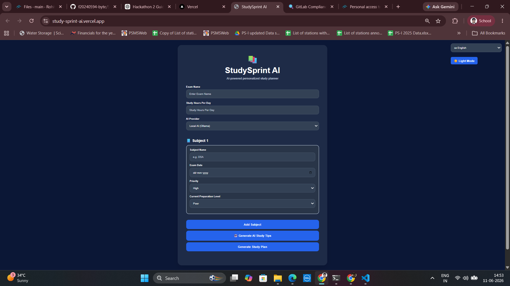

# 📚 StudySprint AI

StudySprint AI is a simple AI-powered personalized study planner built using FastAPI, HTML, CSS, and JavaScript. It helps students generate a structured study plan based on their exam, subjects, study hours, and exam date.

---

## 🚀 Features

- Generate personalized study plans
- Input exam name
- Multiple subject support
- Daily study hour allocation
- Exam date tracking
- Countdown to exam
- Progress tracking using checkboxes
- Clean and responsive UI
- FastAPI backend API
- Interactive Swagger API documentation

---

## Tech Stack

### Frontend
  HTML
  CSS
  JavaScript
### Backend
  FastAPI (Python)
### Database
  JSON file storage (initial MVP)
### AI Component
  Rule-based study plan generation
  Optional OpenAI/Gemini integration in future

---
## 📂 Project Structure

```text
StudySprint_AI/
│
├── backend/
│   └── app.py
│
├── frontend/
│   ├── index.html
│   ├── style.css
│   └── script.js
│
└── README.md
```

---
## ⚙️ How to Run

### Backend

```bash
cd backend

uvicorn app:app --reload
```

Backend runs at:

```text
http://127.0.0.1:8000
```

Swagger API Docs:

```text
http://127.0.0.1:8000/docs
```

---

### Frontend

Open `frontend/index.html` using VS Code Live Server.

Frontend runs at:

```text
http://127.0.0.1:5500
```

---

## 📸 Application Screenshots

### Main Interface



---

### Generated Personalized Study Plan


---

## 📋 Sample Input

**Exam Name**

```text
SEMESTER
```
**Subjects**

```text
DSA, CP, OOPS, OS, EM, EMT, MPI, DD
```

**Study Hours Per Day**

```text
5
```

**Exam Date**

```text
23-06-2026
```

---
## 📋 Sample Output

```text
DSA - 0.6 hrs
CP - 0.6 hrs
OOPS - 0.6 hrs
OS - 0.6 hrs
EM - 0.6 hrs
EMT - 0.6 hrs
MPI - 0.6 hrs
DD - 0.6 hrs
```

Along with:

- Days left until exam
- Progress tracker
- Interactive checklist

---
## Internationalization (i18n)

StudySprint AI supports:

- English
- Hindi
- Telugu

The selected language is saved using browser localStorage.

---

## 🎯 Future Improvements

- AI-based smart scheduling
- Subject priority weighting
- Export study plan to PDF
- User authentication
- Save plans to database
- Dark mode support

---

## 👨‍💻 Author

**Rohit Fogla**

Built during Hackathon 2 🚀