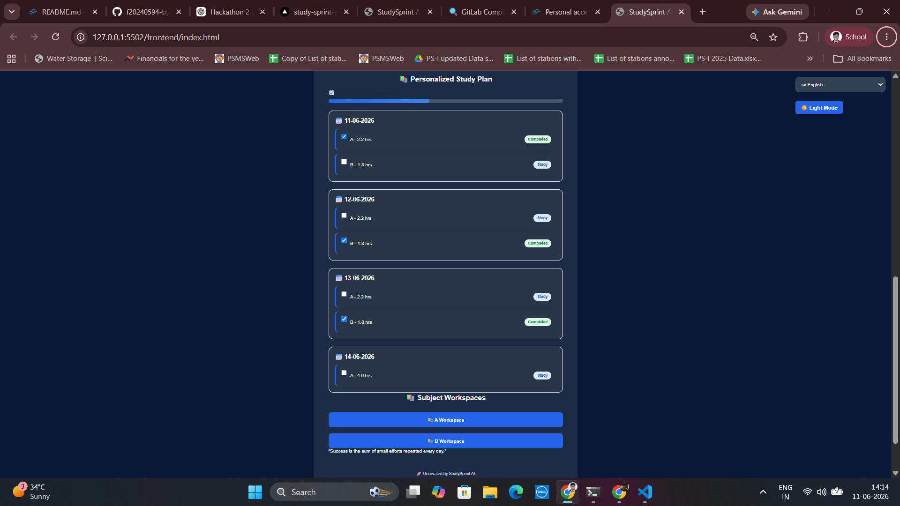

# 📚 StudySprint AI

StudySprint AI is an AI-powered personalized study planner built using FastAPI, HTML, CSS, and JavaScript. It helps students create structured study schedules based on exam dates, subject priorities, preparation levels, and available study hours.

---

## 🚀 Features

* Personalized study plan generation
* Multiple subject support
* Subject-wise priority management
* Preparation level tracking
* Daily study hour allocation
* Exam countdown tracking
* Progress tracking with interactive checklists
* Dark / Light mode
* Multi-language support
* Responsive user interface
* FastAPI backend API
* Swagger API documentation
* AI-ready architecture
* Local AI (Ollama) support
* BYOK (Bring Your Own API Key) support

---

## 🌐 Internationalization (i18n)

StudySprint AI supports multiple Indian languages:

* English
* Hindi (हिन्दी)
* Telugu (తెలుగు)

The selected language is automatically stored using browser localStorage.

---

## 🤖 AI Features

StudySprint AI includes AI-ready functionality and supports multiple AI providers.

### Supported AI Modes

#### Local AI (Mandatory)

The application supports local AI inference through Ollama.

Benefits:

* Runs completely on your device
* No cloud dependency
* Better privacy
* No API cost

#### BYOK (Bring Your Own Key)

Users may optionally connect their own AI provider API key.

Supported providers:

* OpenAI
* Gemini (Future Support)

---

## 🦙 Local AI Setup (Ollama)

### Install Ollama

Visit:

https://ollama.com

### Download a Model

```bash
ollama pull llama3
```

### Start Ollama

```bash
ollama serve
```

Default local endpoint:

```text
http://localhost:11434
```

StudySprint AI can connect to locally running models for AI-powered study recommendations.

---

## 🛠️ Tech Stack

### Frontend

* HTML5
* CSS3
* JavaScript

### Backend

* FastAPI
* Python

### Storage

* Browser Local Storage
* JSON-based persistence (MVP)

### AI

* Rule-Based Study Plan Generation
* Ollama Local AI Support
* BYOK Support
* Future OpenAI/Gemini Integration

---

## 📂 Project Structure

```text
StudySprint_AI/
│
├── backend/
│   └── app.py
│
├── frontend/
│   ├── index.html
│   ├── style.css
│   └── script.js
│
├── screenshots/
│
├── docs/
│
├── README.md
├── LICENSE
├── CONTRIBUTING.md
├── SECURITY.md
├── CODE_OF_CONDUCT.md
└── CHANGELOG.md
```

---

## ⚙️ Installation

### Clone Repository

```bash
git clone https://github.com/f20240594-byte/StudySprint_AI.git

cd StudySprint_AI
```

### Install Dependencies

```bash
pip install -r requirements.txt
```

---

## ▶️ Running the Backend

```bash
cd backend

uvicorn app:app --reload
```

Backend URL:

```text
http://127.0.0.1:8000
```

Swagger Documentation:

```text
http://127.0.0.1:8000/docs
```

---

## ▶️ Running the Frontend

Open:

```text
frontend/index.html
```

using VS Code Live Server.

Frontend URL:

```text
http://127.0.0.1:5500
```

---

## 📸 Screenshots

### Home Screen


### Generated Study Plan



---

## 📋 Sample Input

### Exam Name

```text
SEMESTER
```

### Subjects

```text
DSA
CP
OOPS
OS
EM
EMT
MPI
DD
```

### Study Hours Per Day

```text
5
```

### Exam Date

```text
23-06-2026
```

---

## 📋 Sample Output

```text
DSA - 0.6 hrs
CP - 0.6 hrs
OOPS - 0.6 hrs
OS - 0.6 hrs
EM - 0.6 hrs
EMT - 0.6 hrs
MPI - 0.6 hrs
DD - 0.6 hrs
```

Additional features:

* Exam countdown
* Progress tracking
* Interactive checklist
* Personalized schedule generation

---

## 🌙 User Experience Features

* Dark Mode
* Light Mode
* Mobile Responsive Layout
* Language Switching
* Interactive Progress Tracking

---

## 🚀 Deployment

StudySprint AI can be deployed on:

* Vercel
* Render
* Railway
* Localhost

---

## 🎯 Future Improvements

* AI-generated study tips
* AI-powered subject difficulty estimation
* PDF export
* Authentication system
* Cloud database integration
* Calendar synchronization
* Smart revision scheduling
* Ollama-powered study recommendations

---

## 🤝 Contributing

Contributions are welcome.

Please read:

* CONTRIBUTING.md
* CODE_OF_CONDUCT.md
* SECURITY.md

before submitting pull requests.

---

## 📜 License

This project is licensed under the AGPL-3.0 License.

See the LICENSE file for details.

---

## 👨‍💻 Author

**Rohit Fogla**

Built during Hackathon 2 🚀
