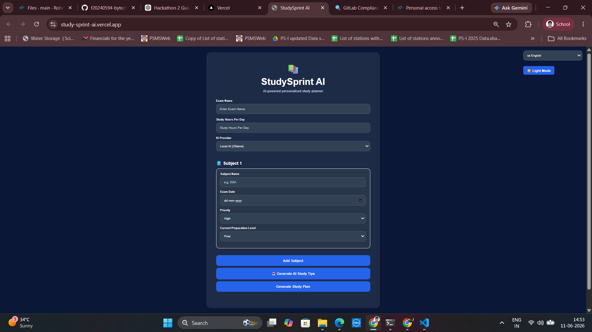
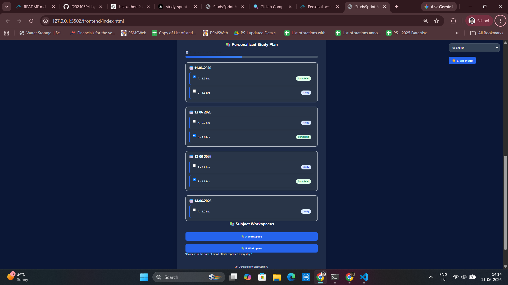

# 📚 StudySprint AI

## AI-Powered Personalized Study Planner for Students

StudySprint AI is an AI-powered study planning platform that helps students generate personalized study schedules based on exam dates, subject priorities, preparation levels, and available study hours. The platform combines intelligent scheduling algorithms with AI-generated recommendations to improve productivity and academic performance.

---

# 🎯 Problem Statement

Students often struggle to create effective study plans while managing multiple subjects, deadlines, and varying levels of preparation. Manual planning is time-consuming and often ineffective.

StudySprint AI automates this process by generating structured and personalized study schedules, helping students stay organized and focus on their academic goals.

---

# 🚀 Features

## Study Planning

* Personalized study plan generation
* Multiple subject support
* Subject-wise priority management
* Preparation level tracking
* Daily study hour allocation
* Exam countdown tracking
* Smart schedule generation

## AI Features

* AI-generated study tips
* Ollama local AI support
* Google Gemini integration
* Google ADK integration
* BYOK (Bring Your Own API Key)

## User Experience

* Dark Mode / Light Mode
* Responsive Design
* Mobile-Friendly Interface
* Interactive Progress Tracking
* Multi-Language Support

## Developer Features

* FastAPI Backend
* REST API Architecture
* Swagger API Documentation
* Modular Codebase
* Easy Deployment

---

# 🌐 Supported Languages

* English
* Hindi (हिन्दी)
* Telugu (తెలుగు)

Language preferences are automatically saved using browser Local Storage.

---

# 🤖 AI Integration

## Ollama (Local AI)

Benefits:

* Runs locally on your machine
* No API costs
* Better privacy
* Offline support

Supported Models:

* Llama 3
* Mistral

## Google Gemini

Benefits:

* Cloud-based AI
* Faster recommendations
* Personalized study tips

## Google ADK

StudySprint AI integrates Google ADK to support agent-based AI workflows and future autonomous study assistance features.

---

# 🏗️ System Architecture

```text
User Input
    │
    ▼
Frontend (HTML/CSS/JS)
    │
    ▼
FastAPI Backend
    │
    ├── Study Plan Generator
    ├── Priority Calculator
    ├── Preparation Analyzer
    ├── Exam Countdown Logic
    └── AI Recommendation Engine
            │
            ├── Ollama
            ├── Gemini
            └── Google ADK
    │
    ▼
Generated Study Plan
    │
    ▼
Progress Tracking & AI Tips
```

---

# 🔄 Workflow

1. User enters exam information
2. User adds subjects
3. User selects priorities
4. User selects preparation levels
5. User enters study hours
6. Backend calculates subject weights
7. Study plan is generated
8. AI recommendations are generated
9. User tracks progress

---

# 🛠️ Tech Stack

## Frontend

* HTML5
* CSS3
* JavaScript

## Backend

* FastAPI
* Python

## AI

* Ollama
* Google Gemini
* Google ADK

## Storage

* Browser Local Storage
* JSON Persistence

---

# 📂 Project Structure

```text
StudySprint_AI/
│
├── backend/
│   ├── app.py
│   └── adk_agent.py
│
├── frontend/
│   ├── index.html
│   ├── style.css
│   └── script.js
│
├── screenshots/
│
├── README.md
├── requirements.txt
├── vercel.json
├── LICENSE
├── CONTRIBUTING.md
├── SECURITY.md
├── CODE_OF_CONDUCT.md
└── CHANGELOG.md
```

---

# ⚙️ Installation

## Clone Repository

```bash
git clone https://github.com/f20240594-byte/StudySprint_AI.git

cd StudySprint_AI
```

## Install Dependencies

```bash
pip install -r requirements.txt
```

---

# 🔐 Environment Variables

Create a `.env` file:

```env
GEMINI_API_KEY=YOUR_GEMINI_API_KEY
```

---

# 🦙 Ollama Setup

Install Ollama:

https://ollama.com

Pull a model:

```bash
ollama pull mistral
```

Start Ollama:

```bash
ollama serve
```

Default endpoint:

```text
http://localhost:11434
```

---

# ▶️ Running the Backend

```bash
cd backend

uvicorn app:app --reload
```

Backend URL:

```text
http://127.0.0.1:8000
```

Swagger Documentation:

```text
http://127.0.0.1:8000/docs
```

---

# ▶️ Running the Frontend

Open:

```text
frontend/index.html
```

using VS Code Live Server.

Frontend URL:

```text
http://127.0.0.1:5500
```

---

# 🔌 API Endpoints

## Generate Study Plan

```http
POST /generate-plan
```

## Agent Information

```http
GET /agent
```

Returns information about the integrated Google ADK Agent.

---

# 📋 Sample Input

```json
{
  "exam": "Semester Exams",
  "hours_per_day": 5,
  "subjects": [
    {
      "name": "DSA",
      "priority": "High",
      "preparation": "Poor",
      "exam_date": "2026-06-23"
    }
  ]
}
```

---

# 📋 Sample Output

```text
DSA - 0.6 hrs
CP - 0.6 hrs
OOPS - 0.6 hrs
OS - 0.6 hrs
EM - 0.6 hrs
EMT - 0.6 hrs
MPI - 0.6 hrs
DD - 0.6 hrs
```

Additional Features:

* Exam Countdown
* AI-Generated Study Tips
* Progress Tracking
* Interactive Checklist

---

## 📸 Screenshots

### Home Screen



### Generated Study Plan



---

# 🚀 Deployment

Supported Platforms:

* Vercel
* Railway
* Render
* Localhost

---

# 🗺️ Future Roadmap

* Authentication System
* Cloud Database Integration
* Calendar Synchronization
* Email Reminders
* PDF Export
* AI Revision Planner
* Performance Analytics
* Mobile Application

---

# 🤝 Contributing

Contributions are welcome.

```bash
git checkout -b feature/new-feature

git commit -m "Add new feature"

git push origin feature/new-feature
```

Then create a Pull Request.

---

# 🙏 Acknowledgements

* FastAPI
* Ollama
* Google Gemini
* Google ADK
* OpenAI
* Python Community
* Swecha Hackathon Program

---

# 📜 License

Licensed under the AGPL-3.0 License.

See the LICENSE file for details.

---

# 👨‍💻 Author

**Rohit Fogla**

B.Tech Student | Aspiring Software Development Engineer

Built during Hackathon 2 🚀

---

# ⭐ Why StudySprint AI?

* Personalized study planning
* AI-powered recommendations
* Local AI support
* Multi-language support
* FastAPI backend
* Modern responsive UI
* Open-source and extensible
* Designed for students, by a student
